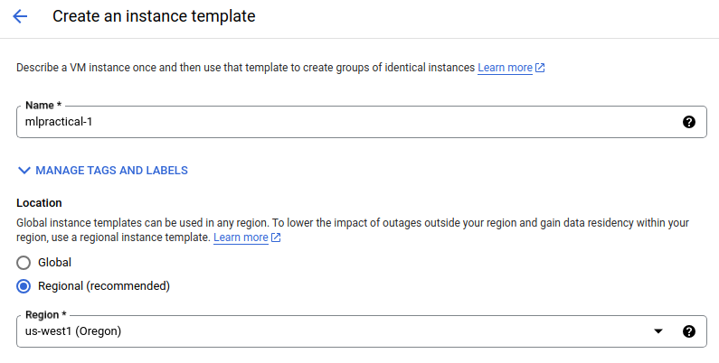
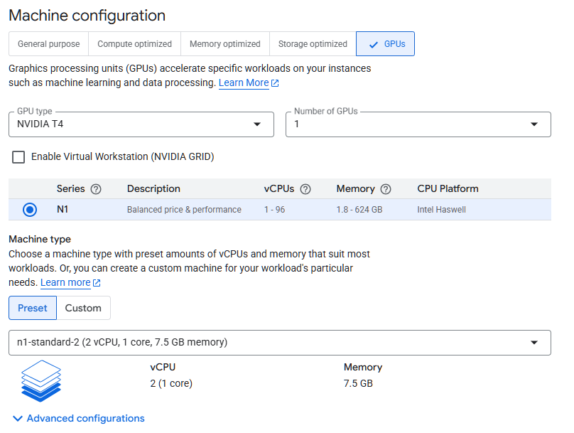
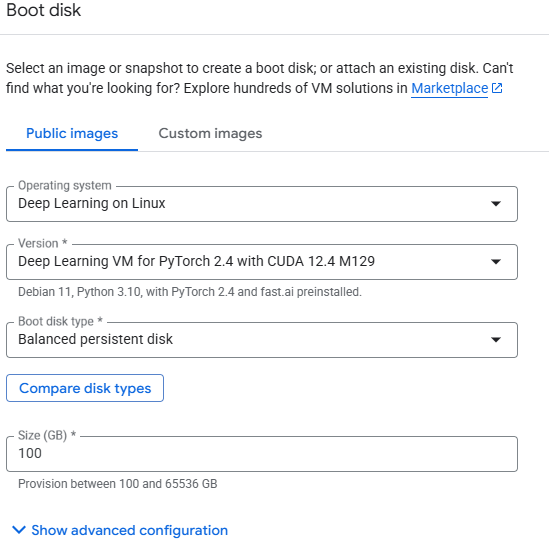
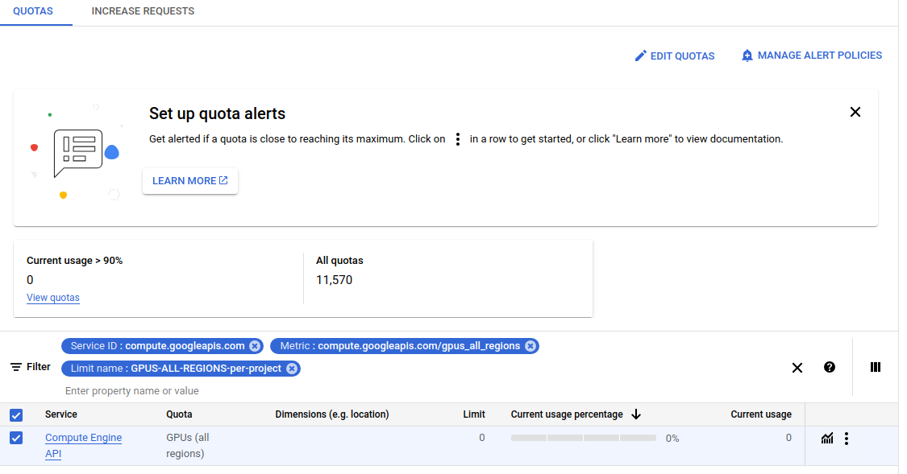

# Google Cloud Usage Tutorial

This document has been created to help you setup a google cloud instance to be used for the MLP course using the student credit the course has acquired.
This document is non-exhaustive and many more useful information is available on the [google cloud documentation page](https://cloud.google.com/docs/).
For any question you might have, that is not covered here, a quick google search should get you what you need. Anything in the official google cloud docs should be very helpful.

> ⚠️ **WARNING**: Read these instructions carefully. You will be given $50 worth of credits and you will need to manage them properly. We will not be able to provide more credits.


### Creating Your Account and Project

1. **Create a new project:**
   - Login with your preferred Gmail account to [Google Cloud Console](https://cloud.google.com/)
   - Click on `Console` (upper right corner)
   - Click on `Select a Project` (left of the search bar at the top)
   - Click on `New Project` (right side of the pop-up)
   - Name your project: `sxxxxxxx-MLPractical` (replace `sxxxxxxx` with your student number)
   - **Make sure you are on this project before following the next steps** 
2. **Retrieve your coupon:**
   - Follow the instructions in the coupon retrieval link that you received
   
3. **Activate your coupon:**
   - Once you receive your coupon, follow the email instructions to add it to your account
   
4. **Set up billing for your project:**
   - Go to the [Google Cloud Console](https://console.cloud.google.com/) and select your project
   - Click on the `Billing` tile
   - If prompted, add the billing account and choose `Billing Account for Education`
   - Under the billing account, click `Account Management` (left-hand side tab)
   - Verify your project appears under `Projects linked to this billing account`
   - If not listed, click `Add projects` and select your project from the list  

### Creating an Instance Template and VM Instance

1. **Access Compute Engine:**
   - On the console page, click the menu button (three lines) at the top left corner
   - In the `Compute Engine` sub-menu, select `Instance Templates`
   - Enable `Compute Engine API` if prompted
   
2. **Create instance template:**
   - Click on `Create instance template`
   - Name the template: `mlpractical-1`
   
3. **Select location:**
   - Choose `Regional` as the location type
   - Select any region/zone you like
   - **Note:** Each zone has a limited number of GPUs. For our large class, it's better to spread out across zones. Please check [here](#important-notes-about-gpu-selection-and-credits) if you have trouble creating the instance

   

4. **Configure machine:**
   - Under `Machine Configuration`, select `GPU` machine family
   - Select **one NVIDIA T4** GPU
   - **Important:** T4 GPUs are the cheapest option. Others can cost up to 8 times more!
   - In `Machine type`, under `PRESET`, select `n1-standard-2 (2 vCPU, 1 core, 7.5GB memory)`

   

5. **Configure boot disk:**
   - Under `Boot disk`, click `Change`
   - In the right-hand menu (under `PUBLIC IMAGES`), select:
     * Operating system: `Deep Learning on Linux`
     * Version: `Deep Learning VM for PyTorch 2.4 with CUDA 12.4 M129`
       * **Note:** If unavailable, use any `Deep Learning VM for PyTorch 2.4 ***` instead
     * Boot disk type: `Balanced persistent disk`
     * Size: `100` GB
   - Click `Select` at the bottom

   

6. **Set availability policies:**
   - Under `Availability policies`, set `VM provisioning model` to `Standard`
   - Optionally: `Enable display device` if you want to use a GUI (not necessary for coursework)
   - Leave other options as default
   - Click `CREATE`

7. **Create the VM instance:**
   - Tick your newly created template
   - Click `CREATE VM` (top center)
   - Click `CREATE`
   - Your instance should be ready in 1-2 minutes

#### Troubleshooting: GPU Quota Issues

If your instance fails to create with this error:
```
The GPUS-ALL-REGIONS-per-project quota maximum has been exceeded. Current limit: 0.0. Metric: compute.googleapis.com/gpus_all_regions.
```

Follow these steps:

1. Click on `REQUEST QUOTA` in the notification
2. Tick `Compute Engine API` and click `EDIT QUOTAS` (top right)

   

3. In the box that opens on the right:
   - Set `New Limit` to `1`
   - In the description, mention: "Need GPU for machine learning coursework"
   
4. Click `NEXT`, fill in your details, and click `SUBMIT REQUEST`

5. Wait for confirmation:
   - You will receive a confirmation email (may take several minutes)
   - The quota limit usually appears 10-15 minutes after the confirmation email
   - Verify the GPU (All Regions) Quota Limit is set to 1
   
6. Retry creating the VM instance using your template 


#### Important Notes About GPU Selection and Credits

**GPU Selection:**
- Try to first select **1 x T4 GPU** (other GPUs can be much more expensive)
- GPU availability in Google Cloud is limited. Try multiple regions if needed. 
- T4 availability is especially limited. If unavailable, try **Tesla P4** as an alternative
  - P4 costs almost double, but should still provide enough time for experiments
  - **Important:** If you change GPU type, verify the boot disk configuration remains the same
- Be patient here. If you repeatedly get an error of no gpu availability, try again after some time.

**Credit Management:**
- You have **$50** of credit = approximately **140 hours** of T4 GPU usage
- Billing counts ONLY when the machine is running
- This is more than enough for coursework if you:
  - Turn off your instance when not in use
  - Don't leave it running overnight
- **Tip:** Complete all coding locally, then use the cloud only for running experiments 


### Logging Into Your Instance via Terminal

**Prerequisites:** Open a DICE terminal window (or your local environment)

1. **Activate conda environment:**
   ```bash
   conda activate mlp
   ```

2. **Download gcloud toolkit:**
   ```bash
   curl -O https://dl.google.com/dl/cloudsdk/channels/rapid/downloads/google-cloud-cli-linux-x86_64.tar.gz
   ```

3. **Install gcloud toolkit:**
   ```bash
   tar zxvf google-cloud-cli-linux-x86_64.tar.gz; bash google-cloud-sdk/install.sh
   ```
   - You may be asked for a passphrase to generate your local key - use a password of your choice
   - Answer "yes" to any Yes/No questions that appear

4. **Reset terminal and authenticate:**
   ```bash
   reset; source ~/.bashrc
   gcloud auth login
   ```
   - Follow the prompts to get a token for your current machine

5. **Set your active project:**
   ```bash
   gcloud config set project PROJECT_ID
   ```
   - Replace `PROJECT_ID` with your actual project ID
   - Find your project ID in the projects dropdown menu at the top of Google Compute Engine
   - If you followed the naming convention, it should be: `sxxxxxxx-mlpractical`

6. **Connect to your instance:**
   - Ensure your VM is running in the Compute Engine window
   - On the line for instance `mlpractical-1`, click the dropdown arrow next to `SSH`
   - Choose `View gcloud command`
   - Copy the command to your terminal and press Enter

7. **Set up SSH key:**
   - Add a password for your SSH key (and remember it!)
   - Re-enter the password when prompted to unlock your SSH key

8. **IMPORTANT - First login:**
   - You will be asked if you want to install NVIDIA drivers
   - Agree to the installation to ensure proper GPU functionality

9. **Verify GPU installation:**
    ```bash
    nvidia-smi
    ```
    - This should report 1 GPU
    - If not, the driver installation may have failed (see troubleshooting section)

10. **Test PyTorch GPU access:**
    ```bash
    python
    ```
    ```python
    import torch
    torch.cuda.is_available()
    ```
    - Should return `True`
    ```python
    exit()
    ```

11. **Clone the mlpractical repository:**
    ```bash
    git clone https://github.com/cortu01/mlpractical.git ~/mlpractical
    cd ~/mlpractical
    git checkout mlp2025-26/mlp_compute_engines
    ```

12. **Test GPU training:**
    ```bash
    python train_evaluate_emnist_classification_system.py --filepath_to_arguments_json_file experiment_configs/emnist_tutorial_config.json
    ```
    - You should see an experiment running using the GPU
    - Expected performance: 26-30 it/s (iterations per second)
    - Stop anytime with `Ctrl+C`

**✓ Success!** You are now ready to run your experiments.

**To log out:** Type `exit` in the terminal

### Managing Your Instance

#### Stopping Your Instance

> ⚠️ **IMPORTANT:** Always stop your instance when not using it! You pay for uptime, not computational cycles.

**To stop your instance:**
1. Go to `Compute Engine` → `VM instances` on Google Cloud Platform
2. Select your instance
3. Click `Stop`

#### Future SSH Access

To access your instance in future sessions, simply run the `gcloud` command you copied from the Google Compute Engine instance page.

## Copying Data To and From Your Instance

For detailed instructions on transferring files:

- **Official documentation:** [Transferring files to VMs from Linux, macOS and Windows](https://cloud.google.com/compute/docs/instances/transfer-files?hl=en)
- **Copying data guide:** [Google Cloud copying data](https://cloud.google.com/filestore/docs/copying-data)
- **SSH key setup:** [Setting up SSH keys (Linux or macOS)](https://cloud.google.com/compute/docs/instances/access-overview?hl=en)
- **Using rsync:** See this [Stack Overflow post](https://stackoverflow.com/questions/27857532/rsync-to-google-compute-engine-instance-from-jenkins) for copying from local machine to Google instance

## Running Experiments Over SSH

**Problem:** If your SSH connection fails while running an experiment, the experiment is normally killed.

**Solution:** Use `screen` to create persistent sessions that keep running even when disconnected.

### Using Screen

**Create a new session:**
```bash
screen
```

**List all available sessions:**
```bash
screen -ls
```

**Reattach to a session:**
```bash
screen -d -r screen_id
```
(Replace `screen_id` with the ID of the session you want to enter)

**Keyboard shortcuts while in a session:**
- `Ctrl+A` then `Esc` - Pause process and enable scrolling
- `Ctrl+A` then `D` - Detach from session while leaving it running (reattach later with `screen -r`)
- `Ctrl+A` then `N` - Switch to next session
- `Ctrl+A` then `C` - Create a new session

**Alternatives:** You can also use `nohup` or `tmux`. Consult online tutorials to learn these tools.
 
## Troubleshooting

### Common Issues and Solutions

| Error | Solution |
| --- | --- |
| ```ERROR: (gcloud.compute.ssh) [/usr/bin/ssh] exited with return code [255].``` | Delete the ssh key files and try again: ```rm ~/.ssh/google_compute_engine*``` |
|"Mapping" error after following step 3 (```tar zxvf google-cloud-sdk-365.0.0-linux-x86_64.tar.gz; bash google-cloud-sdk/install.sh```) | This is due to conflicts and several packages not being installed properly according to your Python version when creating your Conda environment. Run ```conda create --name mlp python=3.9``` to recreate the environment supported with Python 3.9.  Then, activate the environment ```conda activate mlp``` and follow the instructions from step 3 again.  |
|"Mapping" error even after successfully completing steps 3 and 4 when using the ```gcloud``` command | Restart your computer and run the following command: ```export CLOUDSDK_PYTHON="/usr/bin/python3"``` |
| ```gcloud command not found``` | Restart your computer and run the following command: ```export CLOUDSDK_PYTHON="/usr/bin/python3"``` |
| ```module 'collections' has no attribute 'Mapping'``` when installing the Google Cloud SDK | Install Google Cloud SDK with brew: ```brew install --cask google-cloud-sdk```|
| ```Access blocked: authorisation error``` in your browser after running ```gcloud auth login``` | Run ```gcloud components update``` and retry to login again. |
| ```ModuleNotFoundError: No module named 'GPUtil'``` | Install the GPUtil package and you should be able to run the script afterwards: ```pip install GPUtil``` |
| ```module mlp not found``` | Install the mlp package in your environment: ```pip install -e .``` |
| ```NVIDIA-SMI has failed because it couldn't communicate with the NVIDIA driver. Make sure that the latest NVIDIA driver is installed and running.``` | Remove the current driver by running: ```cd /``` and ```sudo apt purge nvidia-*``` Follow step 11 of the instructions or the following commands: (1) download the R470 driver ```wget https://us.download.nvidia.com/XFree86/Linux-x86_64/470.223.02/NVIDIA-Linux-x86_64-470.223.02.run```, (2) change the file permissions to make it executable with ```chmod +x NVIDIA-Linux-x86_64-470.223.02.run``` and (3) install the driver ```sudo ./NVIDIA-Linux-x86_64-470.223.02.run``` |
| ```module 'torch' has no attribute 'cuda'``` | You most probably have a file named ```torch.py``` in your current directory. Rename it to something else and try again. You might need to run the setup again. Else ```import torch``` will be calling this file instead of the PyTorch library and thus causing a conflict. |
| ```Finalizing NVIDIA driver installation. Error! Your kernel headers for kernel 5.10.0-26-cloud-amd64 cannot be found. Please install the linux-headers-5.10.0-26-cloud-amd64 package, or use the --kernelsourcedir option to tell DKMS where it's located. Driver updated for latest kernel.``` | Install the header package with ```sudo apt install linux-headers-5.10.0-26-cloud-amd64``` |